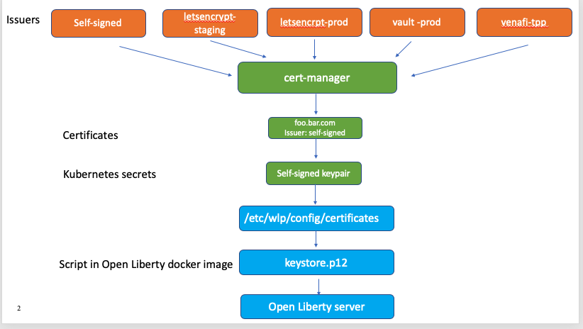

# Sample - Enabling SSL using a certificate created and managed by cert-manager for an Open Liberty Application
This sample installs and uses [cert-manager](https://cert-manager.io/docs/) to create a self-signed certificate. It uses the certificate to enable SSL in an Open-Liberty application running on OCP 4.2+


## Cert-Manager Flow


## Prerequisites
1. Have an OCP 4.2+ Cluster already setup
2. Have a terminal logged in as admin to the OCP cluster using the `oc` CLI
3. Already have operator-based Kabanero Foundation installed.

## Install Steps
1. From your terminal, Install cert-manager using the [Installation Steps](https://cert-manager.io/docs/installation/openshift/)
2. From Your Browser, go to the OpenShift portal for your OCP system.
3. Go to the OperatorHub and Install the `Open Liberty Operator`  
4. Verify the status of installing the `Open Liberty Operator` is `InstallSucceeded`  


## Modify the Open-Liberty kernal docker image  
This sample mounts a self-signed certificate created by cert-manager to the `OpenLibertyApplication` pod in the `/etc/wlp/config/certificates/` directory. You must modify the docker image to create a keystore from the certificate so that Open Liberty can utilize it for SSL.  
Follow these steps for configuring your docker image:  
1. Clone the OpenLiberty/ci.docker github repo:  
  `git clone git@github.com:OpenLiberty/ci.docker.git`  
2. Modify ci.docker/releases/latest/kernel/helpers/runtime/docker-server.sh  
  Before the line with `exec "$@"`  
  Add the following lines:  
  ```
publicCert="/etc/wlp/config/certificates/tls.crt"
privateKey="/etc/wlp/config/certificates/tls.key"

# If the CA tls.crt and tls.key exist, convert to P12 and use
if [ -e $publicCert ] && [ -e $privateKey ]
then
  #Always generate on startup
  /opt/ol/helpers/runtime/createKeystoreFromCert.sh
fi  
```  
  
3. Copy the `createKeystoreFromCert.sh` from this repo to your `ci.docker/releases/latest/kernel/helpers/runtime/` directory  
  
4. Build the kernal image, from the `ci.docker/` directory  
  Run the following command:  
```  
./build/build.sh --dir=releases/latest/kernel --dockerfile=Dockerfile.ubi.adoptopenjdk8 --tag=<yourKernalTag>  
```  
\*Optional: You can also replace `Dockerfile.ubi.adoptopenjdk8` with any available image at this [repository](https://github.com/OpenLiberty/ci.docker/tree/master/releases/latest/kernel)
\*Replace `<yourKernalTag>` with any name you want to tag the modified kernal image  


## Creating your docker image
Build an Open-Liberty Docker image for your application following the [Steps](https://github.com/OpenLiberty/ci.docker#building-an-application-image)  
* Note: you must replace `FROM open-liberty:kernel` with `FROM <yourKernalTag>:latest`  

## Create a self-signed certificate for an OpenLibertyApplication
1. Create `libertySelfSignedClusterIssuer.yaml` with the following yaml:    
```  
apiVersion: certmanager.k8s.io/v1alpha1 
kind: ClusterIssuer 
metadata: 
    name: liberty-selfsigning-issuer 
spec: 
    selfSigned: {}  
```  
2. Create `libertySelfSignedCert.yaml` with the following yaml:
```  
apiVersion: certmanager.k8s.io/v1alpha1
kind: Certificate
metadata:
  name: liberty-cert
spec:
  secretName: liberty-cert-secret
  issuerRef:
    name: liberty-selfsigning-issuer
    kind: ClusterIssuer
  commonName: "defaultServer"
  organization:
    - Example CA
  dnsNames:
  - defaultServer  
```  
3. Run the following commands to create the cluster resources for the yaml files above:  
- Create a self-signing ClusterIssuer: `oc create -f libertySelfSignedClusterIssuer.yaml`  
- Create a self-signed Certificate: `oc create -f libertySelfSignedCert.yaml`

## Create an OpenLibertyApplication Deployment
1. Create `libertyApp.yaml` with the following yaml:  
```  
apiVersion: openliberty.io/v1beta1
kind: OpenLibertyApplication
metadata:
  name: libapp
spec:
  applicationImage: quay.io/my-repo/my-app:1.0
  service:
    type: ClusterIP
    port: 9443
  expose: false

  volumes:
  - name: certificates
    secret:
      secretName: liberty-cert-secret

  volumeMounts:
  - name: certificates
    mountPath: /etc/wlp/config/certificates
    readOnly: true  
```  
* Replace `quay.io/my-repo/my-app:1.0` in the yaml above with your liberty docker image's docker registry location.  
2. Create `libertyAppSecureRoute.yaml` with the following yaml:  
```  
kind: Route
apiVersion: route.openshift.io/v1
metadata:
  name: libapp
  labels:
    app.kubernetes.io/instance: libapp
    app.kubernetes.io/managed-by: open-liberty-operator
    app.kubernetes.io/name: libapp
spec:
  to:
    kind: Service
    name: libapp
    weight: 100
  port:
    targetPort: 9443-tcp
  tls:
    termination: passthrough
    insecureEdgeTerminationPolicy: Redirect
  wildcardPolicy: None  
```  
3. Run the following commands to create the cluster resources for the yaml files above:  
- Create your OpenLibertyApplication deployment: `oc create -f libertyApp.yaml`
- Create a networking route to your deployment: `oc create -f libertyAppSecureRoute.yaml`   
  
Note: All of the commands for creating the ClusterIssuer, Certificate, OpenLibertyApplication, and Route are run in the `createSample.sh` script.

## Accessing Your OpenLibertyApplication after deployment  
1. From your browser, go to your OpenShift cluster portal  
2. In the menu on the left side of the screen, go to _Networking_ > _Routes_ and the link to your deployment will be listed under _Location_.

## Sample Scripts
Create the Demo OpenLibertyApplication and the required resources  
`. createSample.sh`  

The `createSample.sh` script listed above will do the following:  
1. Create a `ClusterIssuer`  
2. Create a `Certificate`  
3. Create an `OpenLibertyApplication`  
4. Create a networking `Route` to map your application to a public url and port.  

Delete the demo application instance and its resources  
`. deleteSample.sh`


